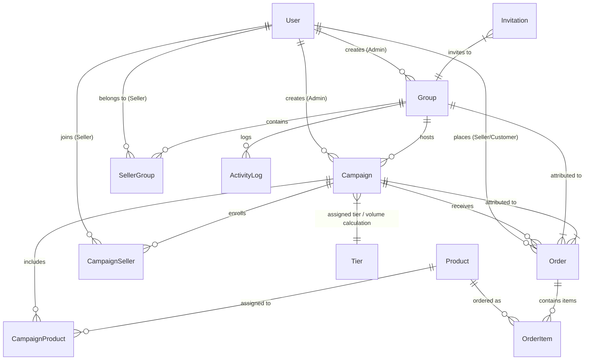

# ProteinW Backend API

ProteinW Backend is a robust, scalable, and secure REST API powering the ProteinW fundraising dashboard platform. It handles role-based authorization, dynamic campaign management, sales volume commission tier calculations, automated group progress updates, real-time WebSocket events, background queues, and detailed analytics for admins and sellers.

---

## 🚀 Technologies

- **Runtime Environment**: Node.js (v18+)
- **Language**: TypeScript
- **Framework**: Express.js
- **Database**: MongoDB (via Mongoose ODM)
- **Real-Time Communication**: Socket.io
- **Job Queues & Workers**: BullMQ (Redis-backed)
- **Task Scheduling**: Node-cron
- **Email Dispatching**: Nodemailer
- **Request Validation**: Zod
- **Security**: JWT (Access & Refresh Tokens) & bcrypt password hashing

---

## 📐 Database Architecture & Entity Relationships

The platform relies on interconnected relational schemas stored in MongoDB. Below is the Mermaid Entity-Relationship (ER) diagram illustrating the data models and their associations:



### Full Database Schemas Detail

#### 1. `User` Model (`auth.model.ts`)
| Field | Type | Options / Description |
|---|---|---|
| `name` | String | Required |
| `email` | String | Required, Unique, Lowercase |
| `password` | String | Required (hashed via bcrypt) |
| `phone` | String | Optional |
| `photo` | String | Optional (Profile image URL) |
| `role` | String | Enum: `"SUPER_ADMIN"`, `"ADMIN"`, `"SELLER"`, Default: `"SELLER"` |
| `isActive` | Boolean | Default: `true` |
| `isDeleted` | Boolean | Default: `false` |
| `isApproved` | Boolean | Default: `true` for SELLER/SUPER_ADMIN, `false` for ADMIN |
| `approvedBy` | ObjectId | Ref: `"User"` (Super Admin who approved) |
| `verificationToken` | String | Optional (Email verification token) |
| `verificationCode` | String | Optional (6-digit OTP code) |
| `verificationExpiry` | Date | Optional |

#### 2. `Group` Model (`group.model.ts`)
| Field | Type | Options / Description |
|---|---|---|
| `name` | String | Required |
| `shortDescription` | String | Required |
| `code` | String | Unique group invite/reference code |
| `createdBy` | ObjectId | Ref: `"User"` (Admin user) |
| `isActive` | Boolean | Default: `true` |
| `isDeleted` | Boolean | Default: `false` |

#### 3. `Campaign` Model (`campaign.model.ts`)
| Field | Type | Options / Description |
|---|---|---|
| `name` | String | Required |
| `shortDescription` | String | Required |
| `code` | String | Unique campaign code |
| `target` | Number | Required (Package target volume goal) |
| `startDate` | Date | Optional |
| `endDate` | Date | Required |
| `groupId` | ObjectId | Ref: `"Group"`, Required, Indexed |
| `createdBy` | ObjectId | Ref: `"User"`, Required |
| `status` | String | Enum: `"DRAFT"`, `"ACTIVE"`, `"FULFILMENT"`, `"COMPLETED"`, Default: `"ACTIVE"`, Indexed |
| `tierId` | ObjectId | Ref: `"Tier"`, Optional, Indexed |
| `tierAssignDate` | Date | Optional, Indexed |
| `isDeleted` | Boolean | Default: `false`, Indexed |

#### 4. `Tier` Model (`tier.model.ts`)
| Field | Type | Options / Description |
|---|---|---|
| `name` | String | Required (e.g. `"STANDARD ENTRY"`, `"GROWTH ACCELERATOR"`) |
| `percentage` | Number | Required (e.g. `40`, `45`, `50`) |
| `minSalesVolume` | Number | Required |
| `maxSalesVolume` | Number | Optional |
| `isPopular` | Boolean | Default: `false` |
| `isActive` | Boolean | Default: `true` |
| `isDeleted` | Boolean | Default: `false` |

#### 5. `SellerGroup` Model (`sellerGroup.model.ts`)
| Field | Type | Options / Description |
|---|---|---|
| `sellerId` | ObjectId | Ref: `"User"`, Required |
| `groupId` | ObjectId | Ref: `"Group"`, Required |
| `isDeleted` | Boolean | Default: `false` |
| `joinedAt` | Date | Default: `Date.now` |

#### 6. `CampaignSeller` Model (`campaignSeller.model.ts`)
| Field | Type | Options / Description |
|---|---|---|
| `sellerId` | ObjectId | Ref: `"User"`, Required |
| `campaignId` | ObjectId | Ref: `"Campaign"`, Required |
| `isDeleted` | Boolean | Default: `false` |
| `joinedAt` | Date | Default: `Date.now` |

#### 7. `Product` Model (`product.model.ts`)
| Field | Type | Options / Description |
|---|---|---|
| `name` | String | Required |
| `description` | String | Required |
| `price` | Number | Required (Price in SEK) |
| `packageSize` | String | Required |
| `images` | Array[String] | Product image URLs |
| `category` | String | Required |
| `isActive` | Boolean | Default: `true` |
| `isDeleted` | Boolean | Default: `false` |

#### 8. `CampaignProduct` Model (`campaignProduct.model.ts`)
| Field | Type | Options / Description |
|---|---|---|
| `campaignId` | ObjectId | Ref: `"Campaign"`, Required |
| `productId` | ObjectId | Ref: `"Product"`, Required |
| `isActive` | Boolean | Default: `true` |
| `isDeleted` | Boolean | Default: `false` |

#### 9. `Order` Model (`order.model.ts`)
| Field | Type | Options / Description |
|---|---|---|
| `orderNumber` | String | Required, Unique |
| `campaignId` | ObjectId | Ref: `"Campaign"`, Required |
| `groupId` | ObjectId | Ref: `"Group"`, Required |
| `sellerId` | ObjectId | Ref: `"User"`, Optional (Attributed seller) |
| `buyerInfo` | Object | `{ name, email, phone }` |
| `shippingAddress` | Object | `{ street, city, postalCode, locality }` |
| `items` | Array[Object] | `[{ productId, productName, quantity, price, totalPrice }]` |
| `totalPackage` | Number | Sum of all item quantities |
| `totalPrice` | Number | Total monetary price (SEK) |
| `status` | String | Enum: `"pending"`, `"confirmed"`, `"shipped"`, `"delivered"`, `"cancelled"`, Default: `"pending"` |
| `isDeleted` | Boolean | Default: `false` |

#### 10. `ActivityLog` Model (`activityLog.model.ts`)
| Field | Type | Options / Description |
|---|---|---|
| `groupId` | ObjectId | Ref: `"Group"`, Required |
| `type` | String | Enum: `"CAMPAIGN"`, `"MEMBER"`, `"ORDER"`, `"TIER"` |
| `title` | String | Required |
| `description` | String | Required |

#### 11. `Invitation` Model (`invitation.model.ts`)
| Field | Type | Options / Description |
|---|---|---|
| `email` | String | Required |
| `groupId` | ObjectId | Ref: `"Group"`, Required |
| `invitedBy` | ObjectId | Ref: `"User"`, Required |
| `code` | String | Unique invite token |
| `status` | String | Enum: `"PENDING"`, `"ACCEPTED"`, `"EXPIRED"`, Default: `"PENDING"` |
| `expiresAt` | Date | Expiry date |

---

## 🛠️ Project Structure & Directory Layout

```text
src/
├── app/
│   ├── config/            # Environment variables & database setup
│   ├── middlewares/       # Auth guard, authorization, global error handler, file upload
│   ├── modules/           # Domain modules
│   │   ├── activityLog/   # Timeline audit logs
│   │   ├── auth/          # User auth, roles, and admin approval management
│   │   ├── campaign/      # Campaign management & profit calculations
│   │   ├── campaignProduct/ # Product assignment to campaigns
│   │   ├── campaignSeller/  # Seller enrollment in campaigns
│   │   ├── contact/       # Support queries & feedback
│   │   ├── dashboard/     # Role-based KPI analytics & statistics engine
│   │   ├── faq/           # Frequently asked questions
│   │   ├── group/         # Group hierarchies & group statistics
│   │   ├── invitation/    # Email onboarding invites for sellers
│   │   ├── order/         # Order processing & sales package tracking
│   │   ├── product/       # Base catalog products
│   │   ├── public/        # Storefront public APIs
│   │   ├── sellerGroup/   # Seller-Group memberships
│   │   └── tier/          # Commission percentage tier rules
│   ├── routes/            # Global route aggregator
│   └── socket/            # Real-time WebSocket gateways
├── errors/                # Standard API error classes & global error formatter
├── utils/                 # Utilities (catchAsync, sendResponse, email dispatchers)
├── server.ts              # Express API server entry point
└── worker.ts              # BullMQ queue worker entry point
```

---

## 🌟 Key Updates & What's New

### 1. Dashboard Module Enhancements
- `GET /api/v1/dashboard/active-campaigns-overview`: Returns total goal targets sum (`totalGoal`), active campaign counts (`activeCampaigns`), and total revenue sales amount (`totalSold`) across all currently active campaigns.
- `GET /api/v1/dashboard/total-distributed-profit`: Calculates total distributed seller profit SEK across all campaigns based on assigned/achieved commission percentage tiers.
- `GET /api/v1/dashboard/superadmin-groups-cards`: Provides key metrics for Super Admins: active groups count, total packages sold in active campaigns, nearest active profit tier percentage (e.g., 40%), and campaigns with deadlines this week.
- `GET /api/v1/dashboard/superadmin-groups-stats`: Provides group performance stats including assigned admin details, seller counts, active campaign counts, units sold, and total sales revenue.

### 2. Admin Approval & Group Guarding
- Admin users (`role: "ADMIN"`) must be approved (`isApproved: true`) by a Super Admin before creating campaigns. Attempting to create a campaign without approval returns `403 Forbidden`.
- Inactive (`isActive: false`) or soft-deleted (`isDeleted: true`) groups cannot have new campaigns created under them.

### 3. Campaign & Seller Management Updates
- Added `tierAssignDate` timestamping on `CampaignModel` whenever commission tiers are explicitly or automatically updated.
- Super Admins can add or restore sellers to campaigns seamlessly via `POST /api/v1/campaign-seller/add-sellers/:campaignId`.
- Added search capabilities (`name` / `code`) for campaign summaries (`GET /api/v1/campaign/admin/summary`).

---

## ⚙️ Environment Variables Configuration

Create a `.env` file in the root directory based on `.env.example`:

```ini
# Environment
NODE_ENV=development
PORT=5000

# MongoDB
MONGODB_URL=mongodb+srv://<YOUR_MONGO_USER>:<YOUR_MONGO_PASS>@cluster0.mongodb.net/<YOUR_DB_NAME>?retryWrites=true&w=majority

# Security
BCRYPT_SALT_ROUNDS=12

# Client
CLIENT_URL=http://localhost:3000

# JWT
JWT_ACCESS_SECRET=<YOUR_ACCESS_SECRET>
JWT_ACCESS_EXPIRE=30d
JWT_REFRESH_SECRET=<YOUR_REFRESH_SECRET>
JWT_REFRESH_EXPIRE=365d
JWT_PASSWORD_RESET_SECRET=<YOUR_PASSWORD_RESET_SECRET>

# Nodemailer (Email)
SMTP_HOST=smtp.gmail.com
SMTP_PORT=587
SMTP_SECURE=false
SMTP_USER=<YOUR_EMAIL>
SMTP_PASS="<YOUR_EMAIL_APP_PASSWORD>"

# Super Admin
SUPERADMINEMAIL=<SUPER_ADMIN_EMAIL>
SUPERADMINPASSWORD=<SUPER_ADMIN_PASSWORD>
```

---

## 📦 Setup & Installation

### Prerequisites
- **Node.js**: `v18.0.0` or higher
- **MongoDB**: Local instance or MongoDB Atlas URI
- **Redis**: Required for BullMQ background workers (`localhost:6379` by default)

### 1. Clone & Install Dependencies
```bash
git clone https://github.com/apponislam/proteinw-backend.git
cd proteinw-backend
npm install
```

### 2. Run in Development Mode
```bash
# Start Express Server
npm run dev

# Start Background Worker Queue (in a separate terminal)
npm run worker:dev
```

### 3. Production Build & Execution
```bash
# Compile TypeScript to JavaScript in /dist
npm run build

# Start Production API Server
npm run start

# Start Production Worker Queue
npm run worker
```

---

## 📄 License

This project is proprietary software licensed under the [MIT License](LICENSE).

